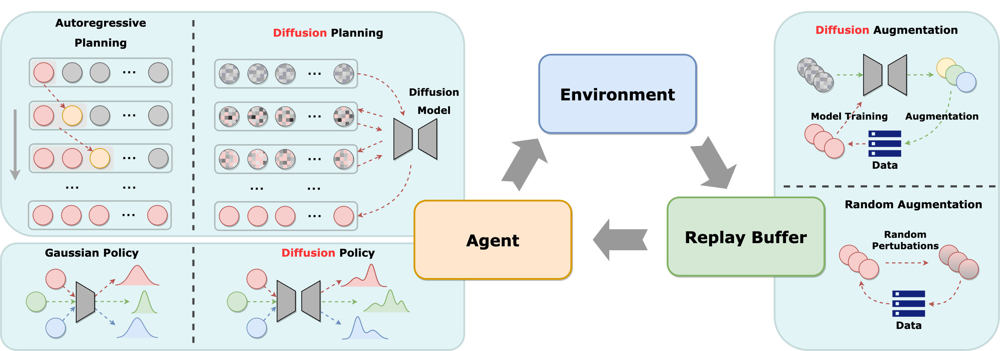

# Diffusion Models for Reinforcement Learning: A Survey
This repository contains a collection of resources and papers on ***Diffusion Models*** for ***RL***.

:rocket: Please check out our survey paper [Diffusion Models for Reinforcement Learning: A Survey](https://arxiv.org/abs/2311.01223)



## Table of Contents
- [Diffusion Models for Reinforcement Learning: A Survey](#diffusion-models-for-reinforcement-learning-a-survey)
  - [Table of Contents](#table-of-contents)
  - [Papers](#papers)
    - [Offline Reinforcement Learning](#offline-reinforcement-learning)
    - [Online Reinforcement Learning](#online-reinforcement-learning)
    - [Imitation Learning](#imitation-learning)
    - [Trajectory Generation](#trajectory-generation)
    - [Data Augmentation](#data-augmentation)
  - [Citation](#citation)

## Papers

### Offline Reinforcement Learning

- **Planning with Diffusion for Flexible Behavior Synthesis**

  Michael Janner, Yilun Du, Joshua B. Tenenbaum, Sergey Levine

  ICML 2022

  [paper](https://arxiv.org/abs/2205.09991) / [code](https://github.com/jannerm/diffuser)

- **Diffusion Policies as an Expressive Policy Class for Offline Reinforcement Learning**
  
  Zhendong Wang, Jonathan J Hunt, Mingyuan Zhou
  
  ICLR 2023
  
  [paper](https://arxiv.org/abs/2208.06193) / [code](https://github.com/zhendong-wang/diffusion-policies-for-offline-rl) 
  
- **Offline Reinforcement Learning via High-fidelity Generative Behavior Modeling**

  Huayu Chen, Cheng Lu, Chengyang Ying, Hang Su, Jun Zhu
  
  ICLR 2023
  
  [paper](https://arxiv.org/abs/2209.14548) / [code](https://github.com/chendrag/sfbc)
  
- **Is Conditional Generative Modeling all you need for Decision-Making?**

  Anurag Ajay, Yilun Du, Abhi Gupta, Joshua B. Tenenbaum, T. Jaakkola, Pulkit Agrawal
  
  ICLR 2023
  
  [paper](https://arxiv.org/abs/2211.15657) / [code](https://github.com/xcvil/decision-diffuser/tree/main/code)
  
- **AdaptDiffuser: Diffusion Models as Adaptive Self-evolving Planners**

  Zhixuan Liang, Yao Mu, Mingyu Ding, Fei Ni, Masayoshi Tomizuka, Ping Luo

  ICML 2023
  
  [paper](https://arxiv.org/abs/2302.01877) / [code](https://github.com/Liang-ZX/adaptdiffuser)
  
- **Metadiffuser: Diffusion Model as Conditional Planner for Offline Meta-RL**

  Fei Ni, Jianye Hao, Yao Mu, Yifu Yuan, Yan Zheng, Bin Wang, Zhixuan Liang
  
  ICML 2023
  
  [paper](https://arxiv.org/abs/2305.19923)

- **Hierarchical Diffusion for Offline Decision Making**

  Wenhao Li, Xiangfeng Wang, Bo Jin, Hongyuan Zha.
  
  ICML 2023
  
  [paper](https://openreview.net/forum?id=55kLa7tH9o) / [code](https://github.com/ewanlee/HDMI)
  
- **Contrastive Energy Prediction for Exact Energy-guided Diffusion Sampling in Offline Reinforcement Learning**

  Cheng Lu, Huayu Chen, Jianfei Chen, Hang Su, Chongxuan Li, Jun Zhu
  
  ICML 2023
  
  [paper](https://arxiv.org/abs/2304.12824) / [code](https://github.com/thu-ml/cep-energy-guided-diffusion)

- **Language Control Diffusion: Efficiently Scaling through Space, Time, and Tasks**

  Edwin Zhang, Yujie Lu, William Wang, Amy Zhang
  
  arXiv 2023
  
  [paper](https://arxiv.org/abs/2210.15629v2) / [code](https://github.com/ezhang7423/language-control-diffusion)

- **IDQL: Implicit Q-Learning as an Actor-Critic Method with Diffusion Policies**

  Philippe Hansen-Estruch, Ilya Kostrikov, Michael Janner, Jakub Grudzien Kuba, Sergey Levine
  
  arXiv 2023
  
  [paper](https://arxiv.org/abs/2304.10573) / [code](https://github.com/philippe-eecs/idql)
  
- **Diffusion Model is an Effective Planner and Data Synthesizer for Multi-Task Reinforcement Learning**

  Haoran He, Chenjia Bai, Kang Xu, Zhuoran Yang, Weinan Zhang, Dong Wang, Bin Zhao, Xuelong Li
  
  NeurIPS 2023
  
  [paper](https://arxiv.org/abs/2305.18459) / [code](https://github.com/tinnerhrhe/MTDiff)
  
- **EDGI: Equivariant Diffusion for Planning with Embodied Agents**

  Johann Brehmer, Joey Bose, Pim de Haan, Taco Cohen
  
  NeurIPS 2023
  
  [paper](https://arxiv.org/abs/2303.12410)
  
- **Extracting Reward Functions from Diffusion Models**

  Felipe Nuti, Tim Franzmeyer, João F. Henriques
  
  NeurIPS 2023
  
  [paper](https://arxiv.org/abs/2306.01804)

- **Can Pre-Trained Text-to-Image Models Generate Visual Goals for Reinforcement Learning?**

  Jialu Gao, Kaizhe Hu, Guowei Xu, Huazhe Xu

  NeurIPS 2023

  [paper](https://arxiv.org/abs/2307.07837)
  
- **Reward-Directed Conditional Diffusion: Provable Distribution Estimation and Reward Improvement**

  Hui Yuan, Kaixuan Huang, Chengzhuo Ni, Minshuo Chen, Mengdi Wang
  
  NeurIPS 2023
  
  [paper](https://arxiv.org/abs/2307.07055) / [code](https://github.com/Kaffaljidhmah2/RCGDM/tree/main)

- **Refining Diffusion Planner for Reliable Behavior Synthesis by Automatic Detection of Infeasible Plans**

  Kyowoon Lee, Seongun Kim, Jaesik Choi

  NeurIPS 2023

  [paper](https://arxiv.org/abs/2310.19427) / [code](https://github.com/leekwoon/rgg)

- **SafeDiffuser: Safe Planning with Diffusion Probabilistic Models**

  Wei Xiao, Tsun-Hsuan Wang, Chuang Gan, Daniela Rus
  
  arXiv 2023
  
  [paper](https://arxiv.org/abs/2306.00148)

- **Efficient Diffusion Policies for Offline Reinforcement Learning**

  Bingyi Kang, Xiao Ma, Chao Du, Tianyu Pang, Shuicheng Yan
  
  arXiv 2023
  
  [paper](https://arxiv.org/abs/2305.20081) / [code](https://github.com/sail-sg/edp)
  
- **MADiff: Offline Multi-agent Learning with Diffusion Models**
  
  Zhengbang Zhu, Minghuan Liu, Liyuan Mao, Bingyi Kang, Minkai Xu, Yong Yu, Stefano Ermon, Weinan Zhang
  
  arXiv 2023
  
  [paper](https://arxiv.org/abs/2305.17330) / [code](https://github.com/zbzhu99/madiff)
  
- **Beyond Conservatism: Diffusion Policies in Offline Multi-agent Reinforcement Learning**

  Zhuoran Li, Ling Pan, Longbo Huang
  
  arXiv 2023
  
  [paper](https://arxiv.org/abs/2307.01472)

- **Fighting Uncertainty with Gradients: Offline Reinforcement Learning via Diffusion Score Matching**

  H.J. Terry Suh, Glen Chou, Hongkai Dai, Lujie Yang, Abhishek Gupta, Russ Tedrake
  
  CoRL 2023
  
  [paper](https://arxiv.org/abs/2306.14079) / [code](https://github.com/hjsuh94/score_po)

- **Value function estimation using conditional diffusion models for control**

  Bogdan Mazoure, Walter Talbott, Miguel Angel Bautista, Devon Hjelm, Alexander Toshev, Josh Susskind
  
  arXiv 2023
  
  [paper](https://arxiv.org/abs/2306.07290)

- **Instructed Diffuser with Temporal Condition Guidance for Offline Reinforcement Learning**

  Jifeng Hu, Yanchao Sun, Sili Huang, SiYuan Guo, Hechang Chen, Li Shen, Lichao Sun, Yi Chang, Dacheng Tao
  
  arXiv 2023
  
  [paper](https://arxiv.org/abs/2306.04875)
  
- **Diffusion Policies for Out-of-Distribution Generalization in Offline Reinforcement Learning**

  Suzan Ece Ada, Erhan Oztop, Emre Ugur
  
  arXiv 2023
  
  [paper](https://arxiv.org/abs/2307.04726)
  
- **Diffusion Policies as Multi-Agent Reinforcement Learning Strategies**

  Jinkun Geng, Xiubo Liang, Hongzhi Wang, Yu Zhao 
  
  ICANN 2023
  
  [paper](https://link.springer.com/chapter/10.1007/978-3-031-44213-1_30)
  
- **DiffCPS: Diffusion Model based Constrained Policy Search for Offline Reinforcement Learning**

  Longxiang He, Linrui Zhang, Junbo Tan, Xueqian Wang
  
  arXiv 2023
  
  [paper](https://arxiv.org/abs/2310.05333) / [code](https://github.com/felix-thu/DiffCPS)
  
- **Score Regularized Policy Optimization through Diffusion Behavior**

  Huayu Chen, Cheng Lu, Zhengyi Wang, Hang Su, Jun Zhu
  
  ICLR 2024
  
  [paper](https://arxiv.org/abs/2310.07297) / [code](https://github.com/thu-ml/srpo)
  
- **Adaptive Online Replanning with Diffusion Models**

  Siyuan Zhou, Yilun Du, Shun Zhang, Mengdi Xu, Yikang Shen, Wei Xiao, Dit-Yan Yeung, Chuang Gan
  
  arXiv 2023
  
  [paper](https://arxiv.org/abs/2310.09629)

- **AlignDiff: Aligning Diverse Human Preferences via Behavior-Customisable Diffusion Model**

  Zibin Dong, Yifu Yuan, Jianye Hao, Fei Ni, Yao Mu, Yan Zheng, Yujing Hu, Tangjie Lv, Changjie Fan, Zhipeng Hu
  
  arXiv 2023
  
  [paper](https://arxiv.org/abs/2310.02054) / [code](https://github.com/aligndiff/aligndiff.github.io)

- **SkillDiffuser: Interpretable Hierarchical Planning via Skill Abstractions in Diffusion-Based Task Execution**

  Zhixuan Liang, Yao Mu, Hengbo Ma, Masayoshi Tomizuka, Mingyu Ding, Ping Luo

  CVPR 2024

  [paper](https://arxiv.org/abs/2312.11598) / [website](https://skilldiffuser.github.io/)

- **Learning a Diffusion Model Policy from Rewards vis Q-score Matching**

  Michael Psenka, Alejandro Escontrela, Pieter Abbeel, Yi Ma

  arXiv 2023

  [paper](https://arxiv.org/abs/2312.11752)

- **Simple Hierarchical Planning with Diffusion**

  Chang Chen, Fei Deng, Kenji Kawaguchi, Caglar Gulcehre, Sungjin Ahn

  ICLR 2024

  [paper](https://arxiv.org/abs/2401.02644)

- **Reasoning with Latent Diffusion in Offline Reinforcement Learning**

  Siddarth Venkatraman, Shivesh Khaitan, Ravi Tej Akella, John Dolan, Jeff Schneider, Glen Berseth

  ICLR 2024

  [paper](https://arxiv.org/abs/2309.06599)

- **Efficient Planning with Latent Diffusion**

  Wenhao Li

  ICLR 2024

  [paper](https://arxiv.org/abs/2310.00311)

- **Contrastive Diffuser: Planning Towards High Return States via Contrastive Learning**

  Yixiang Shan, Zhengbang Zhu, Ting Long, Qifan Liang, Yi Chang, Weinan Zhang, Liang Yin

  arXiv 2024

  [paper](https://arxiv.org/abs/2402.02772)

### Online Reinforcement Learning

- **Policy Representation via Diffusion Probability
Model for Reinforcement Learning**

  Long Yang, Zhixiong Huang, Fenghao Lei, Yucun Zhong, Yiming Yang, Cong Fang, Shiting Wen, Binbin Zhou, Zhouchen Lin

  arXiv 2023

  [paper](https://arxiv.org/abs/2305.13122)

- **Boosting Continuous Control with Consistency Policy**

  Yuhui Chen, Haoran Li, Dongbin Zhao
  
  arXiv 2023
  
  [paper](https://arxiv.org/abs/2310.06343)

- **Diffusion Reward: Learning Rewards via Conditional Video Diffusion**

  Tao Huang*, Guangqi Jiang*, Yanjie Ze, Huazhe Xu

  arXiv 2023

  [paper](https://arxiv.org/abs/2312.14134) / [website](https://diffusion-reward.github.io/) / [code](https://github.com/TaoHuang13/diffusion_reward)

### Imitation Learning

- **Imitating Human Behaviour with Diffusion Models**

  Tim Pearce, Tabish Rashid, Anssi Kanervisto, Dave Bignell, Mingfei Sun, Raluca Georgescu, Sergio Valcarcel Macua, Shan Zheng Tan, Ida Momennejad, Katja Hofmann, Sam Devlin**
  
  ICLR 2023
  
  [paper](https://arxiv.org/abs/2301.10677) / [code](https://github.com/microsoft/imitating-human-behaviour-w-diffusion)

- **Diffusion Policy: Visuomotor Policy Learning via Action Diffusion**

  Cheng Chi, Siyuan Feng, Yilun Du, Zhenjia Xu, Eric Cousineau, Benjamin Burchfiel, Shuran Song
  
  RSS 2023
  
  [paper](https://arxiv.org/abs/2303.04137) / [code](https://github.com/real-stanford/diffusion_policy)
  
- **Goal-Conditioned Imitation Learning using Score-based Diffusion Policies**

  Moritz Reuss, Maximilian Li, Xiaogang Jia, Rudolf Lioutikov
  
  RSS 2023
  
  [paper](https://arxiv.org/abs/2304.02532) / [code](https://github.com/intuitive-robots/beso)
  
- **To the Noise and Back: Diffusion for Shared Autonomy**

  Takuma Yoneda, Luzhe Sun, and Ge Yang, Bradly Stadie, Matthew Walter
  
  RSS 2023
  
  [paper](https://arxiv.org/abs/2302.12244) / [code](https://github.com/ripl/diffusion-for-shared-autonomy)
  
- **DALL-E-Bot: Introducing Web-Scale Diffusion Models to Robotics**

  Ivan Kapelyukh, Vitalis Vosylius, Edward Johns
  
  RAL 2023
  
  [paper](https://arxiv.org/abs/2210.02438)

- **Scaling Up and Distilling Down: Language-Guided Robot Skill Acquisition**

  Huy Ha, Pete Florence, Shuran Song
  
  CoRL 2023
  
  [paper](https://arxiv.org/abs/2307.14535) / [code](https://github.com/real-stanford/scalingup)

- **XSkill: Cross Embodiment Skill Discovery**

  Mengda Xu, Zhenjia Xu, Cheng Chi, Manuela Veloso, Shuran Song
  
  CoRL 2023
  
  [paper](https://arxiv.org/abs/2307.09955)

- **ChainedDiffuser: Unifying Trajectory Diffusion and Keypose Prediction for Robotic Manipulation**

  Zhou Xian, Nikolaos Gkanatsios, Theophile Gervet, Tsung-Wei Ke, Katerina Fragkiadaki
  
  CoRL 2023
  
  [paper](https://openreview.net/forum?id=W0zgY2mBTA8) / [code](https://github.com/zhouxian/chained-diffuser)

- **PlayFusion: Skill Acquisition via Diffusion from Language-Annotated Play**

  Lili Chen, Shikhar Bahl, Deepak Pathak
  
  CoRL 2023
  
  [paper](https://openreview.net/forum?id=afF8RGcBBP)
  
- **Generative Skill Chaining: Long-Horizon Skill Planning with Diffusion Models**

  Utkarsh A. Mishra, Shangjie Xue, Yongxin Chen, Danfei Xu
  
  CoRL 2023
  
  [paper](https://openreview.net/forum?id=HtJE9ly5dT) / [code](https://github.com/generative-skill-chaining/gsc-code)
  
- **Multimodal Diffusion Transformer for Learning from Play**
  
  Moritz Reuss, Rudolf Lioutikov
  
  CoRL 2023
  
  [paper](https://openreview.net/forum?id=nvtxqMGpn1)
  
- **GNFactor: Multi-Task Real Robot Learning with Generalizable Neural Feature Fields**
  
  Yanjie Ze, Ge Yan, Yueh-Hua Wu, Annabella Macaluso, Yuying Ge, Jianglong Ye, Nicklas Hansen, Li Erran Li, Xiaolong Wang
  
  CoRL 2023
  
  [paper](https://arxiv.org/abs/2308.16891) / [code](https://github.com/YanjieZe/GNFactor)

- **Crossway Diffusion: Improving Diffusion-based Visuomotor Policy via Self-supervised Learning**

  Xiang Li, Varun Belagali, Jinghuan Shang, Michael S. Ryoo
  
  arXiv 2023
  
  [paper](https://arxiv.org/abs/2307.01849) / [code](https://github.com/lostxine/crossway_diffusion)
  
- **Diffusion Co-Policy for Synergistic Human-Robot Collaborative Tasks**

  Eley Ng, Ziang Liu, Monroe Kennedy III
  
  arXiv 2023
  
  [paper](https://arxiv.org/abs/2305.12171) / [code](https://github.com/eleyng/diffusion_copolicy)

- **Compositional Foundation Models for Hierarchical Planning**

  Anurag Ajay, Seungwook Han, Yilun Du, Shuang Li, Abhi Gupta, Tommi Jaakkola, Josh Tenenbaum, Leslie Kaelbling, Akash Srivastava, Pulkit Agrawal
  
  NeurIPS 2023
  
  [paper](https://arxiv.org/abs/2309.08587) / [code](https://github.com/anuragajay/hip/tree/main)
  
- **Generating Behaviorally Diverse Policies with Latent Diffusion Models**

  Shashank Hegde, Sumeet Batra, K. R. Zentner, Gaurav S. Sukhatme
  
  NeurIPS 2023
  
  [paper](https://arxiv.org/abs/2305.18738)

- **NoMaD: Goal Masking Diffusion Policies for Navigation and Exploration**

  Ajay Sridhar, Dhruv Shah, Catherine Glossop, Sergey Levine
  
  arXiv 2023
  
  [paper](https://arxiv.org/abs/2310.07896) / [code](https://github.com/robodhruv/visualnav-transformer)

- **Zero-Shot Robotic Manipulation with Pretrained Image-Editing Diffusion Models**

  Kevin Black, Mitsuhiko Nakamoto, Pranav Atreya, Homer Walke, Chelsea Finn, Aviral Kumar, Sergey Levine
  
  arXiv 2023
  
  [paper](https://arxiv.org/abs/2310.10639)

- **Imitation Learning from Purified Demonstrations**

  Yunke Wang, Minjing Dong, Bo Du, Chang Xu

  arXiv 2023

  [paper](https://arxiv.org/abs/2310.07143)

- **Planning as In-Painting: A Diffusion-Based Embodied Task Planning Framework for Environments under Uncertainty**

  Cheng-Fu Yang, Haoyang Xu, Te-Lin Wu, Xiaofeng Gao, Kai-Wei Chang, Feng Gao

  arXiv 2023

  [paper](https://arxiv.org/abs/2312.01097)

- **Diffusion Meets DAgger: Supercharging Eye-in-hand Imitation Learning**

  Xiaoyu Zhang, Matthew Chang, Pranav Kumar, Saurabh Gupta

  arXiv 2024

  [paper](https://arxiv.org/abs/2402.17768)

- **3D Diffusion Policy**

  Yanjie Ze, Gu Zhang, Kangning Zhang, Chenyuan Hu, Muhan Wang, Huazhe Xu

  arXiv 2024

  [paper](https://arxiv.org/abs/2403.03954) / [website](https://3d-diffusion-policy.github.io) / [code](https://github.com/YanjieZe/3D-Diffusion-Policy)

- **Large-Scale Actionless Video Pre-Training via Discrete Diffusion for Efficient Policy Learning**

  Haoran He, Chenjia Bai, Ling Pan, Weinan Zhang, Bin Zhao, Xuelong Li

  arxiv 2024

  [paper](https://arxiv.org/abs/2402.14407) / [website](https://video-diff.github.io/)

### Trajectory Generation

- **MotionDiffuse: Text-Driven Human Motion Generation with Diffusion Model**
  
  Mingyuan Zhang, Zhongang Cai, Liang Pan, Fangzhou Hong, Xinying Guo, Lei Yang, Ziwei Liu
  
  arXiv 2022
  
  [paper](https://arxiv.org/abs/2208.15001) / [code](https://github.com/mingyuan-zhang/MotionDiffuse)
  
- **Human Motion Diffusion Model**

  Guy Tevet, Sigal Raab, Brian Gordon, Yonatan Shafir, Daniel Cohen-Or, Amit H. Bermano
  
  ICLR 2023
  
  [paper](https://arxiv.org/abs/2209.14916) / [code](https://github.com/guytevet/motion-diffusion-model)
  
- **Executing your Commands via Motion Diffusion in Latent Space**
  
  Xin Chen, Biao Jiang, Wen Liu, Zilong Huang, Bin Fu, Tao Chen, Jingyi Yu, Gang Yu
  
  CVPR 2023
  
  [paper](https://arxiv.org/abs/2212.04048) / [code](https://github.com/chenfengye/motion-latent-diffusion)
- **MoFusion: A Framework for Denoising-Diffusion-based Motion Synthesis**

  Rishabh Dabral, Muhammad Hamza Mughal, Vladislav Golyanik, Christian Theobalt
  
  CVPR 2023
  
  [paper](https://arxiv.org/abs/2212.04495) / [code](https://github.com/OFA-Sys/MoFusion)
  
- **ReMoDiffuse: Retrieval-Augmented Motion Diffusion Model**
  
  Mingyuan Zhang, Xinying Guo, Liang Pan, Zhongang Cai, Fangzhou Hong, Huirong Li, Lei Yang, Ziwei Liu
  
  ICCV 2023
  
  [paper](https://arxiv.org/abs/2304.01116) / [code](https://github.com/mingyuan-zhang/ReMoDiffuse)
  
- **MotionDiffuser: Controllable Multi-Agent Motion Prediction using Diffusion**

  Chiyu Max Jiang, Andre Cornman, Cheolho Park, Ben Sapp, Yin Zhou, Dragomir Anguelov
  
  CVPR 2023
  
  [paper](https://arxiv.org/abs/2306.03083)

- **Learning Universal Policies via Text-Guided Video Generation**

  Yilun Du, Mengjiao Yang, Bo Dai, Hanjun Dai, Ofir Nachum, Joshua B. Tenenbaum, Dale Schuurmans, Pieter Abbeel

  NeurIPS 2023

  [paper](https://arxiv.org/abs/2310.08576)

- **EquiDiff: A Conditional Equivariant Diffusion Model For Trajectory Prediction**

  Kehua Chen, Xianda Chen, Zihan Yu, Meixin Zhu, Hai Yang

  arXiv 2023

  [paper](https://arxiv.org/abs/2308.06564)

- **Motion Planning Diffusion: Learning and Planning of Robot Motions with Diffusion Models**

  Joao Carvalho, An T. Le, Mark Baierl, Dorothea Koert, Jan Peters

  IROS 2023

  [paper](https://arxiv.org/abs/2308.01557) / [code](https://github.com/jacarvalho/mpd-public)

- **EDMP: Ensemble-of-costs-guided Diffusion for Motion Planning**

  Kallol Saha, Vishal Mandadi, Jayaram Reddy, Ajit Srikanth, Aditya Agarwal, Bipasha Sen, Arun Singh, Madhava Krishna

  arXiv 2023

  [paper](https://arxiv.org/abs/2309.11414) / [code](https://github.com/vishal-2000/EDMP)

- **Sampling Constrained Trajectories Using Composable Diffusion Models**

  Thomas Power, Rana Soltani-Zarrin, Soshi Iba, Dmitry Berenson

  IROS 2023

  [paper](https://openreview.net/forum?id=UAylEpIMNE)

- **DiMSam: Diffusion Models as Samplers for Task and Motion Planning under Partial Observability**

  Xiaolin Fang, Caelan Reed Garrett, Clemens Eppner, Tomás Lozano-Pérez, Leslie Pack Kaelbling, Dieter Fox
  
  arXiv 2023
  
  [paper](https://arxiv.org/abs/2306.13196)

- **Conditioned Score-Based Models for Learning Collision-Free Trajectory Generation**

  Joao Carvalho, Mark Baierl, Julen Urain, Jan Peters
  
  NeurIPSW 2022
  
  [paper](https://openreview.net/forum?id=4Vqu4N1jjrx)

- **Video Language Planning**

  Yilun Du, Mengjiao Yang, Pete Florence, Fei Xia, Ayzaan Wahid, Brian Ichter, Pierre Sermanet, Tianhe Yu, Pieter Abbeel, Joshua B. Tenenbaum, Leslie Kaelbling, Andy Zeng, Jonathan Tompson
  
  arXiv 2023
  
  [paper](https://arxiv.org/abs/2310.10625) / [code](https://github.com/video-language-planning/vlp_code)
  
- **Learning to Act from Actionless Video through Dense Correspondences**

  Po-Chen Ko, Jiayuan Mao, Yilun Du, Shao-Hua Sun, Joshua B. Tenenbaum
  
  arXiv 2023
  
  [paper](https://arxiv.org/abs/2310.08576) / [code](https://github.com/flow-diffusion/AVDC)
  
- **Learning Interactive Real-World Simulators**

  Mengjiao Yang, Yilun Du, Kamyar Ghasemipour, Jonathan Tompson, Dale Schuurmans, Pieter Abbeel
  
  arXiv 2023
  
  [paper](https://arxiv.org/abs/2310.06114)

### Data Augmentation

- **Scaling Robot Learning with Semantically Imagined Experience**

  Tianhe Yu, Ted Xiao, Austin Stone, Jonathan Tompson, Anthony Brohan, Su Wang, Jaspiar Singh, Clayton Tan, Dee M, Jodilyn Peralta, Brian Ichter, Karol Hausman, Fei Xia
  
  RSS 2023
  
  [paper](https://arxiv.org/abs/2302.11550)
  
- **GenAug: Retargeting behaviors to unseen situations via Generative Augmentation**

  Zoey Chen, Sho Kiami, Abhishek Gupta, Vikash Kumar
  
  RSS 2023
  
  [paper](https://arxiv.org/abs/2302.06671) / [code](https://github.com/genaug/genaug)
  
- **Synthetic Experience Replay**

  Cong Lu, Philip J. Ball, Yee Whye Teh, Jack Parker-Holder
  
  NeurIPS 2023
  
  [paper](https://arxiv.org/abs/2303.06614) / [code](https://github.com/conglu1997/SynthER)

- **World Models via Policy-Guided Trajectory Diffusion**

  Marc Rigter, Jun Yamada, Ingmar Posner

  arXiv 2023

  [paper](https://arxiv.org/abs/2312.08533)

- **Distilling Conditional Diffusion Models for Offline Reinforcement Learning through Trajectory Stitching**

  Shangzhe Li, Xinhua Zhang

  arXiv 2024

  [paper](https://arxiv.org/abs/2402.00807)

- **DiffStitch: Boosting Offline Reinforcement Learning with Diffusion-based Trajectory Stitching**

  Guanghe Li, Yixiang Shan, Zhengbang Zhu, Ting Long, Weinan Zhang

  arXiv 2024

  [paper](https://arxiv.org/abs/2402.02439)

## Citation
```
@article{zhu2023diffusion,
  title={Diffusion Models for Reinforcement Learning: A Survey},
  author={Zhu, Zhengbang and Zhao, Hanye and He, Haoran and Zhong, Yichao and Zhang, Shenyu and Yu, Yong and Zhang, Weinan},
  journal={arXiv preprint arXiv:2311.01223},
  year={2023}
}
```
